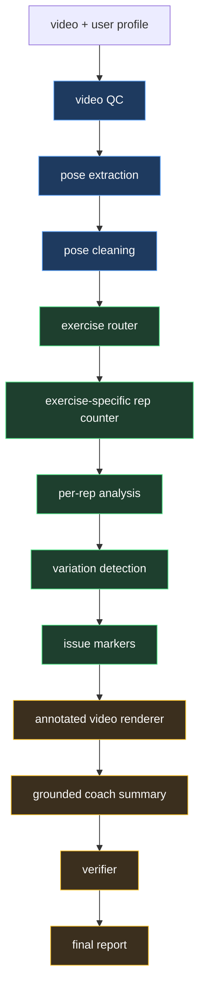

# Spotter

Spotter is a small-model workout form coach I built for a friend.

My friend trains at home: no gym nearby, no budget for a private trainer, and a phone propped on a
shelf is the only feedback they get. Every "AI coach" app they tried wanted a subscription, shipped
their workout videos to a company's servers, or paraphrased generic YouTube advice. So I built
Spotter for them instead.

A user uploads a short exercise video, adds basic training context, and gets a structured form-review
report with rep counts, movement notes, annotated video, and a grounded coach summary — produced by
open-weight models that cost nothing to run and never need an account.

Spotter is for anyone who trains at home because the gym is too far, too crowded, intimidating, or too
expensive to replace with a private trainer. It gives them a second set of eyes without pretending to
be a clinician or a full personal coach.

Spotter is not a medical device. It does not diagnose injuries, claim injury prevention, or replace a
qualified trainer, clinician, or physical therapist.

This build is a practice companion. It is not a medical or fall-risk assessment tool.

## What Spotter Delivers

For each uploaded workout clip, Spotter produces:

- detected exercise and confidence
- rep-by-rep analysis
- valid variation markers versus real form issues
- annotated output video and issue clips
- grounded coach summary with fixes and a next-session plan
- verifier-backed confidence and safety notes

The supported exercise labels are `squat`, `push_up`, `shoulder_press`, and `unknown`. The `unknown`
label is intentional: Spotter should reject unsupported or unclear clips instead of forcing every
video into one of the supported movements.

## Product Flow

Spotter is not a generic chatbot and not a vague video captioner. It is a grounded movement-analysis
pipeline:



The main product decision is simple: structured evidence first, language second. The language model
does not inspect the raw video directly and invent advice. It explains the structured findings that
the pipeline has already produced.

## Small-Model Strategy

Spotter is built around the belief that small, task-specific models can be the right default for many
real products. A small model does not need to act like a large general assistant if the product gives
it a narrow job, clean inputs, and a verifier.

That is the strategy here:

- use pose and deterministic logic to extract evidence before generation
- train small models on the exact task they must perform
- keep each model boundary inspectable
- retrieve exercise-specific knowledge cards instead of relying on generic memory
- evaluate outputs against product contracts, not only fluency
- fall back conservatively when model output is unavailable or ungrounded

For narrow tasks such as exercise routing or structured JSON-to-coaching-summary generation, a
fine-tuned small model can match or beat a much larger generic model on the product's actual quality
bar. The advantage comes from being optimized for the exact schema, vocabulary, examples, and failure
modes Spotter cares about.

## Models We Use

Every runtime model in Spotter is open-weight and small enough to run on a laptop.

| Component                   | Model or method                                  | Role                                                                  |
| --------------------------- | ------------------------------------------------ | --------------------------------------------------------------------- |
| Pose extraction             | MediaPipe Pose Landmarker Lite                   | Extracts body landmarks from video frames.                            |
| Exercise router             | Custom PyTorch BiLSTM over 30-frame pose windows | Classifies `squat`, `push_up`, `shoulder_press`, or `unknown`.        |
| Router baseline             | scikit-learn `HistGradientBoostingClassifier`    | Reference and fallback artifact for router experiments.               |
| Rep counting                | Exercise-specific state machines                 | Counts reps from movement signals without an LLM.                     |
| Issue markers               | Transparent rules over per-rep metrics           | Separates valid variations from likely form issues.                   |
| Coach-summary base          | `nvidia/NVIDIA-Nemotron-3-Nano-4B-BF16`          | Base model for coach-summary LoRA SFT.                                |
| Coach summary               | `aijadugar/spotter-coach-summary1`                | Fine-tuned model for grounded structured coaching output.             |
| Fully local summary path    | Nemotron GGUF through `llama.cpp`                | Optional offline runtime path for small-model inference.              |
| Verifier                    | Deterministic grounding and safety checks        | Blocks unsupported issues, diagnosis language, and ungrounded claims. |

The trained exercise router is intentionally tiny:

| Artifact                        |     Count |
| ------------------------------- | --------: |
| BiLSTM router trainable params  |   182,796 |
| Router input features per frame |       237 |
| Window length                   | 30 frames |
| Output classes                  |         4 |

## Why Open Innovation Matters For This Build

This is a Hacktoberfest "Build for a Friend" project, and open-source AI is not decoration here — it
is the reason my friend can actually use it.

- **It runs on a laptop with no internet.** MediaPipe pose, the 182k-parameter BiLSTM router, and the
  Nemotron-4B coach summary (via `llama.cpp` with a GGUF) are a fully local path. Their workout videos
  never leave their machine.
- **Their data stays theirs.** No server they don't control ever sees a rep. Closed coach apps
  upload every clip to company storage; Spotter's whole pipeline is deterministic code plus open
  weights running on hardware my friend already owns.
- **It costs nothing to run.** No subscription, no API key, no metered inference. The trained router
  and the LoRA coach-summary adapter are free artifacts anyone can download and re-run.
- **I could fine-tune and swap models.** The router and coach summary are open-weight checkpoints
  trained on task-specific data and released under permissive licenses. When a better 4B base model
  ships, the LoRA retrains in one `Modal` job; when my friend wants a different voice for the coach,
  they change one env var. That loop is impossible with a closed API.
- **Open beat closed where it counted.** For a narrow job — route four exercise classes from pose
  windows, render grounded JSON into coaching text — a 4B fine-tuned model with a deterministic
  verifier matches what a much larger generic model does, at zero marginal cost, offline, and with
  every model boundary inspectable. The closed option was never the better fit for this problem.

The open pieces are what make the project work: an open pose model, a self-trained open-weight
router, an open NVIDIA Nemotron base with a released LoRA adapter, and `llama.cpp` as the local
runtime.

## Challenge Snapshot

- Challenge: Hacktoberfest — *Build for a Friend*
- Who it's for: a friend who trains at home without a gym or a coach
- Submission format: Hugging Face Space + local run
- Core impact: private, free, at-home workout feedback from short videos
- Hugging Face Space: [aijadugar/Spotter](https://huggingface.co/spaces/aijadugar/Spotter)
- Repo: [aijadugar/spotter](https://github.com/aijadugar/spotter)
- Router model repo: [aijadugar/spotter-exercise-router](https://huggingface.co/aijadugar/spotter-exercise-router)
- Coach-summary model repo: [aijadugar/spotter-coach-summary1](https://huggingface.co/aijadugar/spotter-coach-summary1)

Tools used in this build:

- `Hugging Face Spaces` for the shareable app surface
- `Hugging Face Inference` and `llama.cpp` for small-model inference
- `Modal` for training, evaluation, merging, and publishing workflows
- `Claude Code` / `OpenAI Codex` as repo-aware coding agents

## Handing It Over

I installed Spotter on my friend's laptop — `uv sync`, download the models once, and the app runs
fully offline. Their first reaction was the one that mattered: *"So it never sends my videos
anywhere?"* They now film a set, get rep counts and annotated form feedback the same evening, and
the check-engine light for "is my squat depth actually improving" finally has an answer that isn't
a stranger on a forum. The feature request they came back with — remember last session's numbers —
is exactly why the repo keeps a local session record and progress plan instead of a cloud profile.

## Run It Locally

The point of this build is that my friend can run it without me, without a cloud account, and without
internet. From a fresh checkout:

```bash
uv sync
uv run python app.py
```

That starts the web app on your machine with Hugging Face-hosted model weights downloaded once. For a
fully offline path, point the coach summary at a local `llama.cpp` server serving the Nemotron GGUF:

```bash
SPOTTER_COACH_SUMMARY_PROVIDER=llama_cpp SPOTTER_LLAMA_CPP_BASE_URL=http://127.0.0.1:8080 \
  uv run python app.py
```

- [demo/README.md](demo/README.md) — router demo clips and expected labels
- `scripts/` — training, evaluation, and publishing entrypoints for the router and coach summary
- `src/spotter/` — the pipeline, exercise strategies, SLM providers, and verifier

## Contributors

- 🚀 [@nvti](https://github.com/nvti)
- 🌿 [@honghanhh](https://github.com/honghanhh)
- 🔧 [@NLag](https://github.com/NLag)
- ✨ [pnhneee](https://github.com/ctpnheee)
