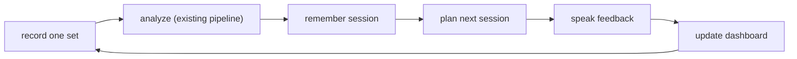
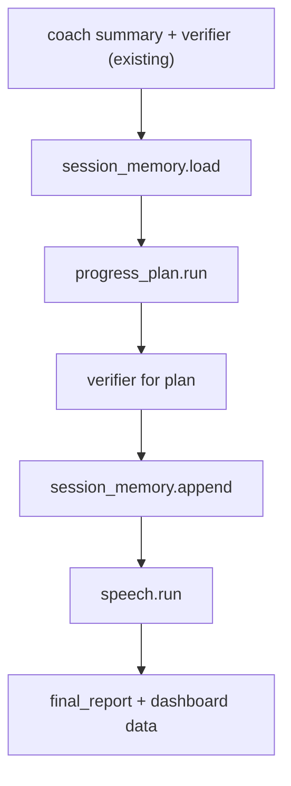
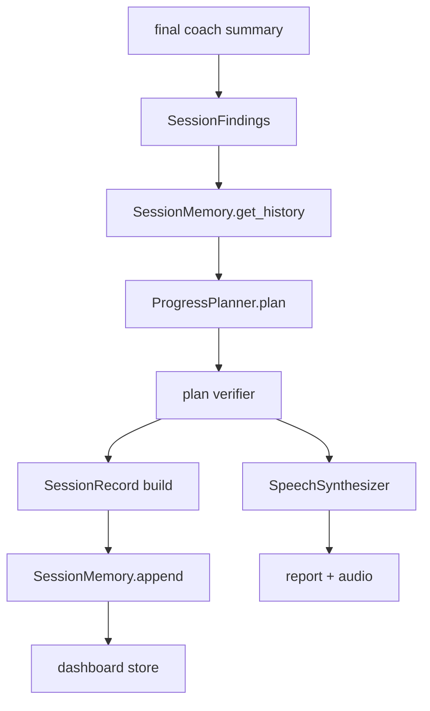

# Spotter Companion - Design Spec

- Status: design approved; spec under review
- Date: 2026-10-03
- Base repo: Spotter (`build-small-hackathon/Spotter`, cloned locally to `spotter/`)
- Working title: Spotter Companion

## 1. Summary

Spotter today is a one-shot workout form reviewer: upload a clip, get a structured report. It has no
memory, no voice, and no sense of progress over time. Spotter Companion turns it into a longitudinal
practice partner for one strength trainee. Each session is analyzed by the existing pipeline, then
remembered, turned into a next-session plan by a small open model, spoken aloud, and charted on a
progress dashboard.

The open model is not decoration. A fine-tuned small model owns the new `progress_plan` task, and we
measure it against the untuned base model. That measurement is the central claim of the project.

## 2. Problem and Motivation

- A single form review is a snapshot. It tells you what happened once, not whether you are improving.
- Home and gym trainees without a coach lose two things at scale: visible progress and encouragement.
  Both are reasons people stop training or stop pushing.
- Form breakdown accumulates across a set and across weeks (fatigue, load). A one-off review cannot see
  the trend, so the most useful coaching signal is exactly the one Spotter currently throws away.
- The challenge requires open-source AI to be what makes the product work. A memory-and-plan loop that
  runs on a small open model satisfies that, and can be shown to beat a baseline on a product metric.

## 3. Target User

- The friend: a strength trainee training at a gym or at home who wants form feedback but does not
  want to pay for a personal trainer.
- Primary language: English. Language is a configuration, not a hardcode, so Hindi or Marathi can be
  added without touching pipeline logic.
- Device: laptop with a webcam. Runs offline-first; hosted pieces are optional enhancements.

## 4. Goals and Non-Goals

Goals:

- Preserve the existing pipeline and its contracts; add stages rather than rewrite.
- Support `squat`, `push_up`, and `shoulder_press` on day one; make adding movements a data exercise,
  not a refactor.
- Remember each session locally, with an optional hosted memory backend.
- Generate a grounded next-session plan with a fine-tuned small open model.
- Speak the summary and cues, with open TTS by default and a hosted voice as a toggle.
- Show a progress dashboard for the trainee.
- Produce a reproducible open-vs-base benchmark for the plan model.

Non-goals:

- Not a medical device. No diagnosis, no injury-prevention claims, no fall-risk scoring.
- Not real-time coaching. Sessions remain short recorded sets, not a live camera loop.
- Not multi-user or social. One trainee, one history.
- No cloud dependency in the core path. The app must run fully offline.

## 5. Product Loop



The differentiator over stock Spotter is the three edges after `analyze`: remember, plan, speak.

## 6. Architecture

### 6.1 Pipeline insertion point

The existing `run_pipeline` (`src/spotter/pipeline.py`) ends at the verifier and final report assembly.
New stages are appended after the coach summary is verified (after the current `emit("coach", "done", ...)`)
and before `final_report` is built. The existing stages and contracts are unchanged.

New order:



### 6.2 New components

| Component | File | Responsibility |
| --- | --- | --- |
| Session memory | `src/spotter/steps/session_memory.py` | Read and append per-session records. SQLite default; optional hosted backend behind one interface. |
| Progress plan | `src/spotter/steps/progress_plan.py` | Turn rolling history plus today's structured findings into a next-session plan. Owned by the fine-tuned model, with a deterministic fallback. |
| Speech | `src/spotter/steps/speech.py` | Convert summary and cues to an audio artifact. Open TTS default; hosted voice toggle. |
| Dashboard | `render/` | Small FastAPI service plus static page that reads the history store and renders progress. |
| Dataset builder | `scripts/build_progress_plan_sft_dataset.py` | Synthesize `(history + findings) -> plan` training and eval data. |
| LoRA config | `configs/progress_plan_lora.default.json` | Training hyperparameters for the plan model. |

### 6.3 Interfaces

Following the existing `CoachSummaryModel` protocol style in `src/spotter/slm/providers.py`.

```python
class SessionMemory(Protocol):
    def get_history(self, profile_key: str, limit: int) -> list[SessionRecord]: ...
    def append(self, record: SessionRecord) -> None: ...

class ProgressPlanner(Protocol):
    def plan(self, history: list[SessionRecord], findings: SessionFindings) -> ProgressPlan: ...

class SpeechSynthesizer(Protocol):
    def synthesize(self, lines: list[str], language: str, out_dir: Path) -> SpeechResult: ...
```

Each component is selected by one environment variable, mirroring `SPOTTER_COACH_SUMMARY_PROVIDER`:

- `SPOTTER_MEMORY_BACKEND` = `sqlite` (default) or `backboard`
- `SPOTTER_TTS_BACKEND` = `open` (default) or `elevenlabs`

### 6.4 Isolation properties

- `session_memory` knows nothing about pose or language models. It stores and returns records.
- `progress_plan` receives only structured records and findings, never raw video or landmarks.
- `speech` receives already-verified text, never generates it.
- The dashboard reads the store directly and never calls the pipeline.

## 7. Data Contracts

Two new artifacts, validated by extending the registry in `src/spotter/contracts.py`.

`session_record.json`:

- `session_id` string
- `timestamp` string (ISO 8601 UTC)
- `profile_key` string (stable per trainee)
- `exercise` string
- `rep_count` integer
- `aggregate_metrics` object (`range_of_motion_score`, `stability_score`, `symmetry_score`, mean rep duration)
- `issue_counts` object (issue label to count)
- `form_score` number 0 to 1
- `source_run_id` string

`progress_plan.json`:

- `focus` string (single priority for next session)
- `targets` list of strings
- `next_session_cues` list of strings
- `encouragement` string
- `confidence_notes` list of strings

`speech.json`:

- `audio_path` string or null
- `language` string
- `lines` list of strings
- `backend` string

Contracts keep the existing rule: structured evidence first, language second. The plan model may only
reference findings that exist in the structured input.

## 8. Data Flow



## 9. The Tinker Experiment

This is the measurable open-source claim.

- Task: `(rolling session history + today's structured findings) -> progress_plan` as strict JSON.
- Dataset: a few hundred synthetic examples generated from real pipeline runs and perturbed histories,
  with a hand-checked sample. Built by `scripts/build_progress_plan_sft_dataset.py` into
  `data/sft/progress_plan_train.jsonl` and `data/sft/progress_plan_eval.jsonl`.
- Base model: a small open model. Default `nvidia/NVIDIA-Nemotron-3-Nano-4B-BF16` for consistency with
  the existing coach-summary work; `Qwen2.5-3B-Instruct` is the low-cost alternative. Confirm current
  Tinker support and pricing before committing.
- Method: LoRA SFT, hyperparameters in `configs/progress_plan_lora.default.json`, adapted from the
  existing `configs/coach_summary_lora.default.json`.
- Evaluation, fine-tuned vs untuned base:
  - grounding: fraction of plans that reference only detected issues
  - schema validity: fraction of outputs parseable into `progress_plan.json`
  - issue precision and recall against held-out labels
  - language quality: native-speaker rating on 20 to 30 samples
  - latency on a laptop, p50 and p95
- Deliverable: a results table in the write-up and a model card.

A task this narrow, with clean structured inputs and a verifier, is exactly where a small tuned model
can match or beat a larger generic one on the product's quality bar.

## 10. Memory Design

- `SqliteSessionMemory` is the default, stored at `runs/history.db`. It has no network dependency.
- `BackboardSessionMemory` implements the same protocol against the hosted memory API. Selected only
  when `SPOTTER_MEMORY_BACKEND=backboard` and a key is present.
- Privacy: records contain structured metrics and issue labels, never video or landmarks. A hosted
  backend therefore shares no imagery.
- If the hosted backend fails, the stage logs and falls back to SQLite for that run. The pipeline never
  fails because memory is unavailable.

## 11. Speech Design

- `OpenTtsSynthesizer` is the default. Candidate open voices: Kokoro or Piper. Verify license and
  per-language quality before selecting; language support is the deciding factor.
- `ElevenLabsSynthesizer` is a toggle for a more natural voice, selected by `SPOTTER_TTS_BACKEND=elevenlabs`.
- Spoken content is limited to the already-verified summary and plan. Speech never invents content.
- The write-up reports where the open voice was good enough and where it was not, and why the default
  stays open.

## 12. Dashboard (Render)

- `render/` holds a small FastAPI service plus a static page.
- Reads the history store and renders: sessions per week, trend of `form_score`, range-of-motion trend,
  and recurring issue labels.
- Reads only; no mutation, no auth secrets in the page.
- Deployed to Render as a supplementary service. The Hugging Face Space remains the primary submission.
- The dashboard is a convenience layer; the local app is the real hand-over.

## 13. Safety and Verification

The verifier (`src/spotter/steps/verifier.py`) already blocks diagnosis language and injury-prevention
claims for the coach summary. Extend it:

- Apply the same checks to `progress_plan` text, not only the coach summary.
- Add patterns for fall-risk and medical-judgment phrasing in plan output.
- Keep the existing `no_issue_outside_json` grounding check for the plan: the plan may not reference
  issues that were not detected.
- On verifier failure, fall back to a deterministic plan built from history trends, mirroring
  `coach_summary_fallback`.
- The UI and README keep a visible line: this is a practice companion, not a medical or fall-risk
  assessment tool. This is mandatory because the product is health-adjacent.

## 14. Error Handling

Offline-first and degrade-never-fail, matching the existing fallback pattern.

| Missing | Behavior |
| --- | --- |
| No history yet | Single-session plan from today's findings only. |
| No plan model | Deterministic rule-based plan from aggregate metrics. |
| No hosted memory | SQLite store. |
| Hosted memory error | Log and continue on SQLite for the run. |
| No TTS backend | Text-only report; no audio artifact. |
| Plan verifier fails | Fallback plan, run still completes. |

## 15. Testing Strategy

- `pytest` for Python, matching `tests/` conventions and the existing mock mode.
- New tests: `test_session_memory.py`, `test_progress_plan.py`, `test_speech.py`.
- Extend `test_pipeline_contracts.py` for `session_record.json` and `progress_plan.json`.
- Extend verifier tests for the new forbidden plan phrases.
- Contract tests assert schema validity and grounding; the fallback paths are tested explicitly.
- `ruff` for lint and format, per `pyproject.toml`.

## 16. Credits Mapping

| Credit | Role | Open-core note |
| --- | --- | --- |
| Tinker | Fine-tune the `progress_plan` model. | The open-vs-base benchmark is the core claim. |
| Backboard | Optional cross-session memory. | SQLite default keeps the app fully open; hosted is a toggle. |
| ElevenLabs | Optional natural voice. | Open TTS is the default; hosted is a toggle. |
| Render | Progress dashboard. | Supplementary; the Space remains the main submission. |

## 17. Order of Work

1. Add `SessionRecord` and `ProgressPlan` contracts and validators.
2. Build `session_memory.py` with SQLite, wire load and append into the pipeline.
3. Build `progress_plan.py` with a deterministic fallback and a provider switch.
4. Build `scripts/build_progress_plan_sft_dataset.py`; generate train and eval data.
5. Run the Tinker LoRA fine-tune; run the evaluation; record results.
6. Add `speech.py` with open TTS default and the hosted toggle.
7. Add the `render/` dashboard and deploy to Render.
8. Add UI affordances: large text and a play-feedback control.
9. Collect a few real clips with the friend; sanity-check counts and issues.
10. Hand over the local build; note the reaction.
11. Write the post: why open mattered, the benchmark table, the friend's result.

## 18. Assumptions and Open Questions

Assumptions:

- The friend trains strength and uses a laptop with a webcam.
- English is the first language; others can be configured later.
- Existing pose and rep logic transfers to `squat`, `push_up`, and `shoulder_press` without change.

Open questions:

- Exact Tinker base model and current pricing.
- Which open TTS supports the target language well enough to be the default.
- Whether the hosted memory backend earns its place versus SQLite for a single trainee.
- Whether the friend will consent to sharing anonymized clips in the write-up.
